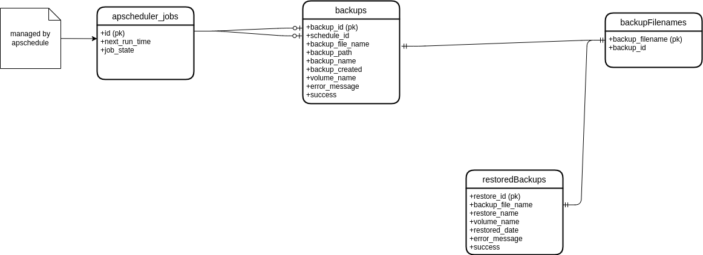

# Database

Just quick doc explaining the database structure. This uses sqlite as the backend database as its simple and works for this use case

## tables

### backups table

holds the backups of the database form either a manual backup or a scheduled backup. One thing to note is that the backup_id
is the job id from the apscheduler job store if its a manual backup and if its a scheduled backup then the backup_id generated when the backup runs and the job_id is added as the schedule_id 

### restoredbackups table

holds the backups that have been restored. The restore_id is the id of the restore job in the apscheduler job store

### errorbackups table

holds the backups that have failed to backup

### errorrestores table

holds the backups that have failed to restore

### backupfilenames table

holds the filenames of the backups with what backup_id its comes from

